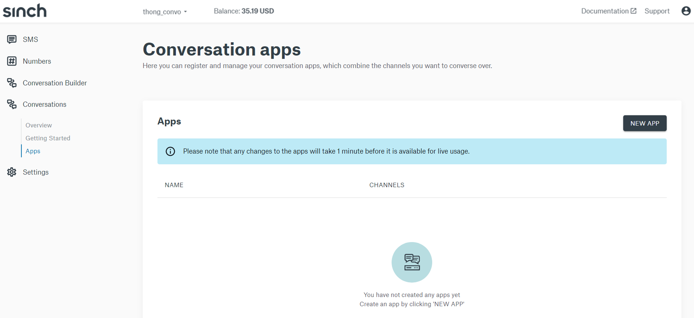
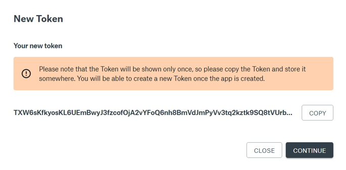
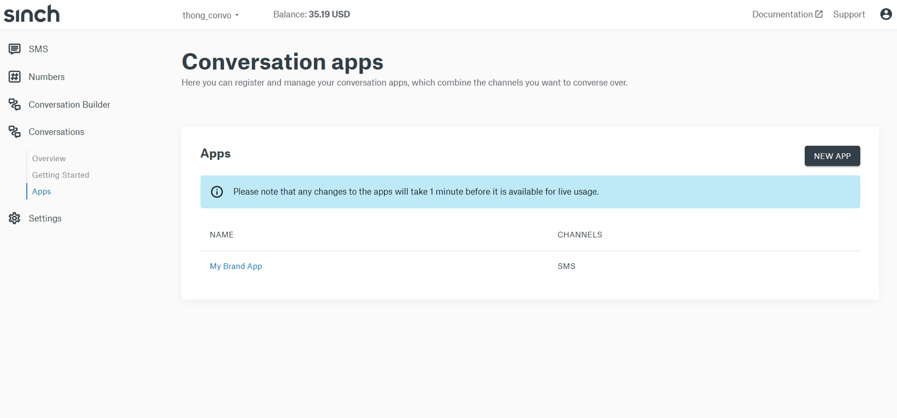
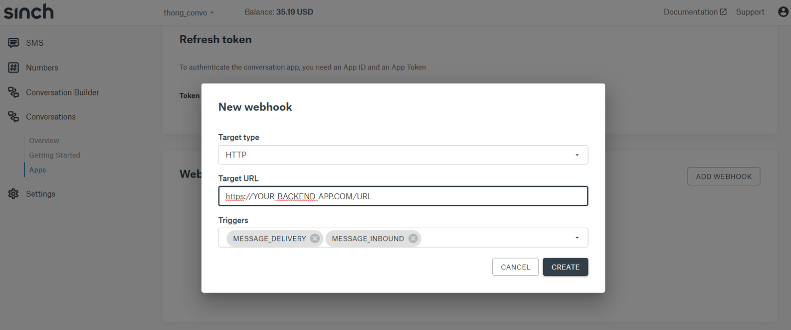
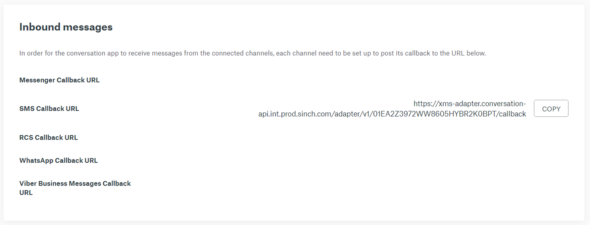
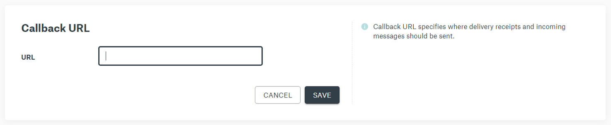

# Add an SMS Channel to your Conversations API App
Hello!  For this tutorial you will learn how to add an SMS channel to your Sinch Conversations APi Application.  You can an your SMS channel one of two ways, either programatically via Sinch Conversations API or through the [Sinch online portal](https://dashboard.sinch.com).  Before we begin here are a few items you should already have:

1. A text enabled *long code* or a *short code* registered with Sinch.
2. Access to the Sinch dashboard where you manage your long code or short code.
3. An SMS *Service Plan ID* and *Secret* to authorize SMS text message requests.
4. A Conversations *App ID* and *Token*.

If you are missing any of items 1-3 above you should begin by registering online at [*Sinch.com*](https://sinch.com).  We'll show you how to create a *New Conversation App* for item 4 since its a very simple set of steps.

## Create a New Conversations App
To create a new Conversations App simply sign in to your [*Sinch Dashboard account*](https://dashboard.sinch.com) and use the left hand navigation to access Conversations > Apps.

<p align="center">

</p>

Click on the *New App* button on the right, "Name" your App and click *Create*.  You will be presented with a *New Token*, copy and store it somewhere safe, you will need it when using the Conversation API.

<p align="center">

</p>

That's it, you have created a Sinch Conversations API App!

## Add SMS Channel to your Conversations App
In your Sinch Dashboard navigate to Conversations > Apps.  Click on the *"App Name"* you wish to add the SMS Channel to.

<p align="center">

</p>

Under *Channels* click on *"Add Channel"*.  Use the drop down to select *"SMS"*, add your SMS *Service Plan ID* to the *"Sender ID"* field, and your SMS Service Plan *API Token* to the channel and click *"Save"*.

<p align="center">

</p>

You have added an SMS Channel to your App.  Just a few more steps to go.

```
Show code to add SMS Channel to the Conversations API App
```

## Configure a Conversation API App Webhook
In order to forward end user text messages received by the Sinch *Conversation API App* to your backend business logic you need to configure the *Webhook* pointing to your business logic backe end.  Within your Conversations > Apps > YOUR APP scroll to the botto section labeled *Webhooks* and click on *"Add Webhook"*.

From the drop down choose *"HTTP"*, add a URL endpoint for your backend, and choose one or more *Triggers* and click *"Create"*.

<p align="center">

</p>

```
Show code here on how to set a webhook for a Converations API App Webhook
```

## Configure the Callback URL for your Inbound SMS Messages
In your Conversation App page, scroll down to the *Inbound messages* section.  Notice there is a URL next to the *SMS Callback URL*, click *"Copy"*.


<p align="center">

</p>

Use the left hand navigation menu to back to SMS > APIs, click on the *"Service Plan ID"* you used for your Conversations API SMS Channel.  Scroll down and *"Edit"* the "Callback URL", paste in the value you copied from your Conversation API App for SMS *Inbound messages*.

<p align="center">

</p>

>
>The URL should look like this: *https://xms-adapter.conversation-api.int.prod.sinch.com/adapter/v1/{{YOUR_APP_ID}}/callback*
>

Great, you are all set!  You can now use your backend to receive and trigger SMS messages to and from your users!


## Send an SMS Message to a Contact
To send an SMS message to a Contact via the Sinch Conversations API App send an HTTP POST with the following JSON:

```
Show how to send a text message to a contact via Conversations API
```
If you chose to receive *Delivery Receipts* via your Conversations API App webhook you may, depending on the target country or carrier of the message recepient, receive status and delivery receipt updates like the ones below.

```
Show status receipts here for SMS MT
```
```
Show delivery receipts here for SMS MT
```


## Receive an SMS Message from a User
Below is an example of an inboud SMS text message posted to your backend system.

```
Show post payload from Converations API App to customer backend via the configured webhook
```


