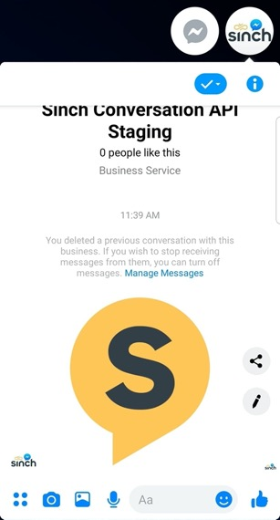
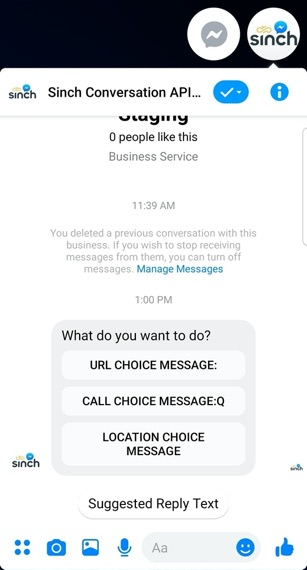
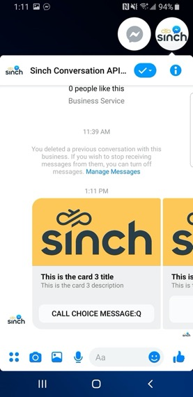
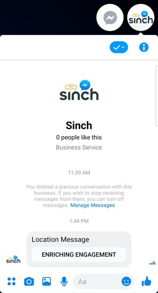

# Advance Facebook Messages

In this blog, we will show you how you can send advance messages such as media, choice, card, carousel, and location messages using Conversation API. 

## Sending Media Message

```javascript
curl --location --request POST 'https://api.conversation-api.prod.sinch.com/v1beta/accounts/{{YOUR_ACCOUNT_ID}}/messages:send' \
-H 'Content-Type: application/json' \
-H 'Authorization: Basic {{YOUR_TOKEN}}' \
 -d '{
    "app_id": "{{YOUR_APP_ID}}",
    "recipient": {
        "contact_id": "{{YOUR_CONTACT_ID}}"
    },
    "message": {
        "text_message": {
            "text": "Text message from Sinch Conversation API."
        }
    },
    "channel_priority_order": [
        "MESSENGER"
    ]
}'
```

<p align="center">

</p>

## Sending Choice Message

```javascript

curl --location --request POST 'https://api.conversation-api.prod.sinch.com/v1beta/accounts/{{YOUR_ACCOUNT_ID}}/messages:send' \

-H 'Content-Type: application/json' \
-H 'Authorization: Basic {{YOUR_TOKEN}}' \
-d '{
    "app_id": "{{YOUR_APP_ID}}",
    "recipient": {
    	"contact_id": "{{YOUR_CONTACT_ID}}"
    },
    "message": {
        "choice_message": {
            "text_message": {
                "text": "What do you want to do?"
            },
            "choices": [
                {
                    "text_message": {
                        "text": "Suggested Reply Text"
                    }
                },
                {
                    "url_message": {
                        "title": "URL Choice Message:",
                        "url": "https://www.sinch.com"
                    }
                },
                {
                    "call_message": {
                        "title": "Call Choice Message:Q",
                        "phone_number": "46732000000"
                    }
                },
                {
                    "location_message": {
                        "title": "Location Choice Message",
                        "label": "Enriching Engagement",
                        "coordinates": {
                            "latitude": 55.610479,
                            "longitude": 13.002873
                        }
                    }
                }
            ]
        }
    },
    "channel_priority_order": [
        "MESSENGER"
    ]
}'
```
<p align="center">

</p>


## Sending Card Message

```javascript
curl --location --request POST 'https://api.conversation-api.prod.sinch.com/v1beta/accounts/{{YOUR_ACCOUNT_ID}}/messages:send' \
-H 'Content-Type: application/json' \
-H 'Authorization: Basic {{YOUR_TOKEN}}' \
 -d '{
    "app_id": "{{YOUR_APP_ID}}",
    "recipient": {
        "contact_id": "{{YOUR_CONTACT_ID}}"
    },
    "message": {
        "card_message": {
            "title": "This is the card title",
            "description": "This is the card description",
            "media_message": {
                "url": "https://1vxc0v12qhrm1e72gq1mmxkf-wpengine.netdna-ssl.com/wp-content/uploads/2019/05/Sinch-logo-Events.png"
            },
            "choices": [
                {
                    "text_message": {
                        "text": "Suggested Reply Text"
                    }
                },
                {
                    "url_message": {
                        "title": "URL Choice Message:",
                        "url": "https://www.sinch.com"
                    }
                },
                {
                    "call_message": {
                        "title": "Call Choice Message:Q",
                        "phone_number": "46732000000"
                    }
                },
                {
                    "location_message": {
                        "title": "Location Choice Message",
                        "label": "Enriching Engagement",
                        "coordinates": {
                            "latitude": 55.610479,
                            "longitude": 13.002873
                        }
                    }
                }
            ]
        }
    },

    "channel_priority_order": [
        "MESSENGER"
    ]
}'
```
<p align="center">

</p>

## Sending Carousel Message

```javascript
curl --location --request POST 'https://api.conversation-api.prod.sinch.com/v1beta/accounts/{{YOUR_ACCOUNT_ID}}/messages:send' \
-H 'Content-Type: application/json' \
-H 'Authorization: Basic {{YOUR_TOKEN}}' \
 -d '{
    "app_id": "{{YOUR_APP_ID}}",
    "recipient": {
        "contact_id": "{{YOUR_CONTACT_ID}}"
    },
   "message": {
        "carousel_message": {
            "cards": [
                {
                    "title": "This is the card 1 title",
                    "description": "This is the card 1 description",
                    "media_message": {
                        "url": "https://1vxc0v12qhrm1e72gq1mmxkf-wpengine.netdna-ssl.com/wp-content/uploads/2019/05/Sinch-logo-Events.png"
                    },
                    "choices": [
                        {
                            "text_message": {
                                "text": "Suggested Reply 1 Text"
                            }
                        },
                        {
                            "text_message": {
                                "text": "Suggested Reply 2 Text"
                            }
                        },
                        {
                            "text_message": {
                                "text": "Suggested Reply 3 Text"
                            }
                        }
                    ]
                },
                {
                    "title": "This is the card 2 title",
                    "description": "This is the card 2 description",
                    "media_message": {
                        "url": "https://1vxc0v12qhrm1e72gq1mmxkf-wpengine.netdna-ssl.com/wp-content/uploads/2019/05/Sinch-logo-Events.png"
                    },
                    "choices": [
                        {
                            "url_message": {
                                "title": "URL Choice Message:",
                                "url": "https://www.sinch.com"
                            }
                        }
                    ]
                },
                {
                    "title": "This is the card 3 title",
                    "description": "This is the card 3 description",
                    "media_message": {
                        "url": "https://1vxc0v12qhrm1e72gq1mmxkf-wpengine.netdna-ssl.com/wp-content/uploads/2019/05/Sinch-logo-Events.png"
                    },
                    "choices": [
                        {
                            "call_message": {
                                "title": "Call Choice Message:Q",
                                "phone_number": "46732000000"
                            }
                        }
                    ]
                },
                {
                    "title": "This is the card 4 title",
                    "description": "This is the card 4 description",
                    "media_message": {
                        "url": "https://1vxc0v12qhrm1e72gq1mmxkf-wpengine.netdna-ssl.com/wp-content/uploads/2019/05/Sinch-logo-Events.png"
                    },
                    "choices": [
                        {
                            "location_message": {
                                "title": "Location Choice Message",
                                "label": "Enriching Engagement",
                                "coordinates": {
                                    "latitude": 55.610479,
                                    "longitude": 13.002873
                                }
                            }
                        }
                    ]
                }
            ]
        }
    },
    "channel_priority_order": [
        "MESSENGER"
    ]
}'
```
<p align="center">

</p>

## Sending Location Message

```javascript
curl --location --request POST 'https://api.conversation-api.prod.sinch.com/v1beta/accounts/{{YOUR_ACCOUNT_ID}}/messages:send' \
-H 'Content-Type: application/json' \
-H 'Authorization: Basic {{YOUR_TOKEN}}' \
 -d '{
    "app_id": "{{YOUR_APP_ID}}",
    "recipient": {
        "contact_id": "{{YOUR_CONTACT_ID}}"
    },
    "message": {
        "location_message": {
            "title": "Location Message",
            "label": "Enriching Engagement",
            "coordinates": {
                "latitude": 55.610479,
                "longitude": 13.002873
            }
        }
    },
    "channel_priority_order": [
        "MESSENGER"
    ]
}'
```

<p align="center">

</p>