# Setup an FB App with Messenger Chat
In this quick start guide we will show you how to create and configure a basic FB Business Page with Messenger chat feature.  Once you complete the steps below you will have an FB App, FB Business Page with Messenger Chat button, a Messenger Token, and a configured Messenger Webhook to use with the Sinch Conversations API.


### Sign up for an FB Developer Account or Sign In and Create your Messenger App
To register for an FB Developer account go to **[Facebook Developer Account](https://developers.facebook.com)** and click **"Get Started"** on the upper right menu.

<p align="center">
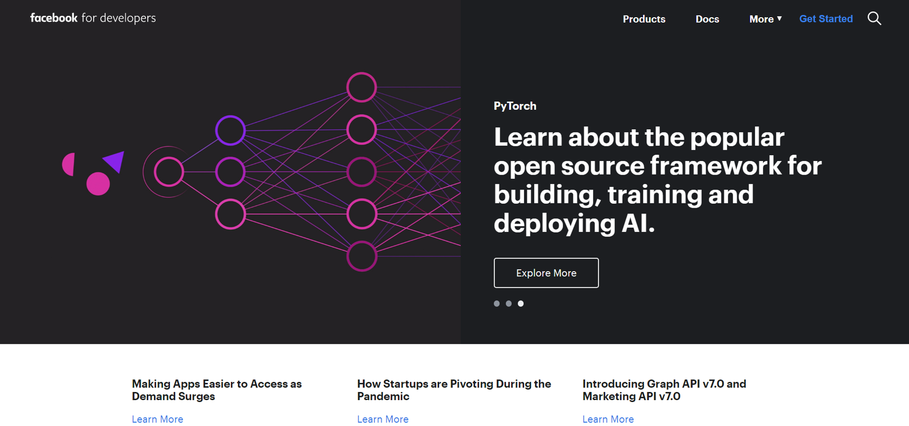
</p>
> 
> If you have an existing FB Developer Account and an FB App, log in and skip to adding and configuring Messenger.
>

Once you have created your Facebook developer account you can choose to **"Create First App"**

<p align="center">
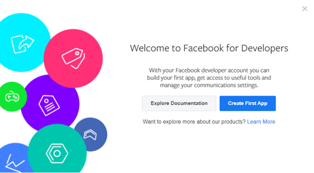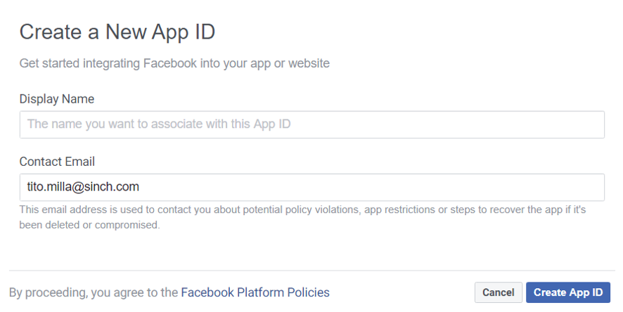
</p>

> 
>Your new *APP ID* will be displayed at the top left of your FB App Dashboard.
>


### Add Messenger Product to your FB App
From your FB Developer Dashboard, under *Add Product*, click on Messenger **"Setup"** button.

<p align="center">
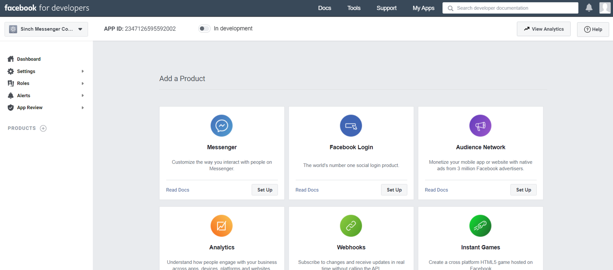
</p>


### Create an FB Business Page
Now that you have added Messenger Product to your FB App we can build your first FB Business Page.  Within your Dasboard under Products > Messenger > Settings page scroll down to **Access Tokens** and click **"Create New Page"** on the upper right.

<p align="center">
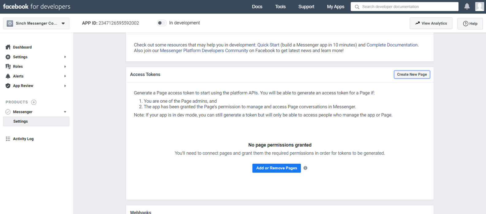
</p>

Next choose to create a **"Business or Brand"** and fill out the ensuing page name and contact form.
<p align="center">
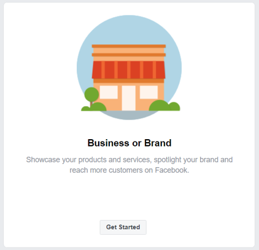
<p>
  
You can choose to **"Skip"** adding 'Profile' and 'Background' pictures as well as **"Not Now"** for the option to 'Add online booking'.  You have now completed creating your Facebook Business Page.  Remember while your FB App is 'In development' the FB Business Page is not visible to anyone except you and other developers you invite to your FB developer account.

>
>Make sure to bookmark your FB Business Page , we will return to it later to add a Messenger chat button.
>

<p align="center">
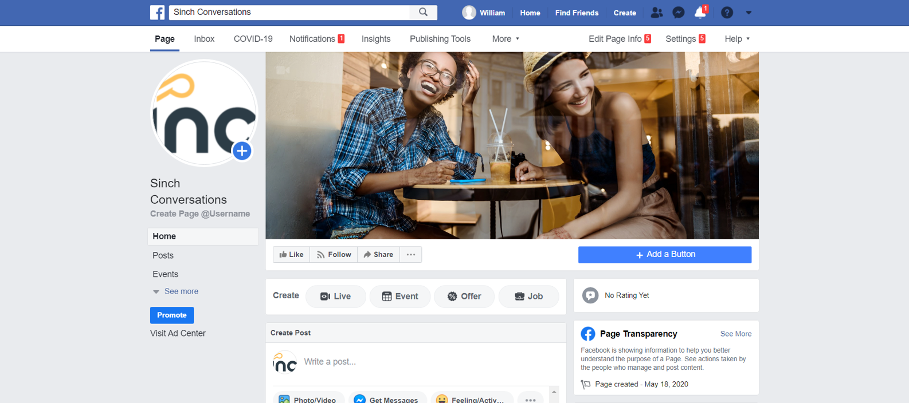
</p>


### Generate your Messenger API Token
To generate your Messenger API Token we'll need to add the new FB Page you created to the Messenger product settings.  Under Within your Dasboard under Products > Messenger > Settings page scroll down to **Access Tokens** and this type choose to **"Add or Remove Pages"**.

<p align="center">
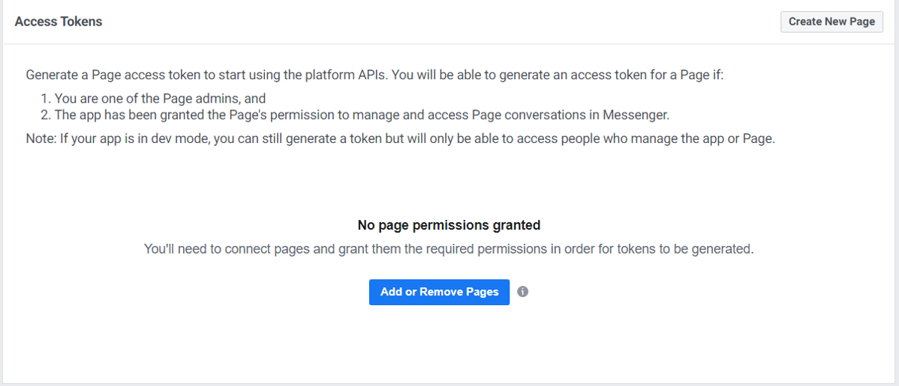
</p>

Now follow the prompts and choose the new FB Page you just created.  Make sure that you leave default setting **Manage and access Page converations in Messenger** set to YES.

<p align="center">
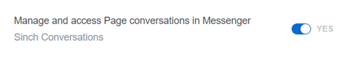
</p>

You will should see your FB Page listed under **Access Tokens**, click on the **"Generate Token"** button.

>
>Copy and store your Messenger Token somewhere safe, we will need it to add the Messenger Channel to your **Sinch Conversations App**.
>

<p align="center">

</p>

### Configure your FB Messegner Channel on Sinch Conversations API

Create and send a POST to **Patch** your Sinch Conversations App with the newly created **Messenger Token**, this will allow Sinch Conversations App to respond to inbound messages posted by visitors of your FB Page.

```
{
    "channel_credentials": [
        
        {
            "channel": "MESSENGER",
            "static_token": {
                "claimed_identity": "{{YOUR_FB_APP_NAME}}",
                "token": "{{YOUR_FB_PAGE_MESSENGER_TOKEN}}"
            }
        }
    ]
}
```

### Add a Messenger Chat Button to your FB Business Page

Lets return to your FB Page and add a Messenger button. Click on **"+ Add Button"**.

<p align="center">
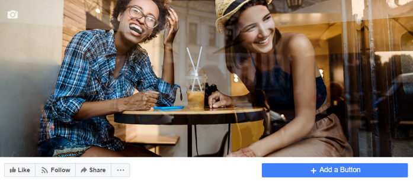
</p>
  
Choose **Send Message** and click **"Next"**.
  
  <p align="center">
  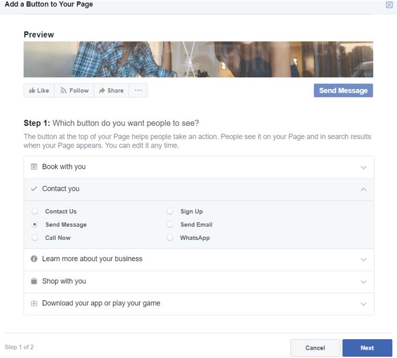
  </p>
 
 Click on **"Messenger"** and then click **"Finish"**.
 
 <p align="center">
 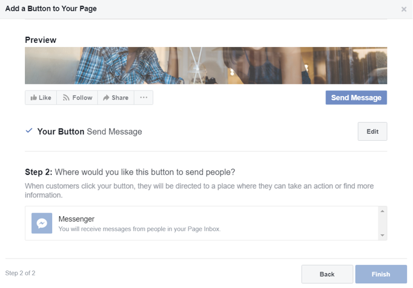
 </p>
 

### Configure the Messenger Webhook

The Messenger Webhook Settings configuration forwards message events posted on your **FB Page** to your **Sinch Conversations App**.  To set the configuration click on **"Add Callback URL"** in FB App Dashboard > Products > Messenger > Settings **Webhooks**.

<p align="center">
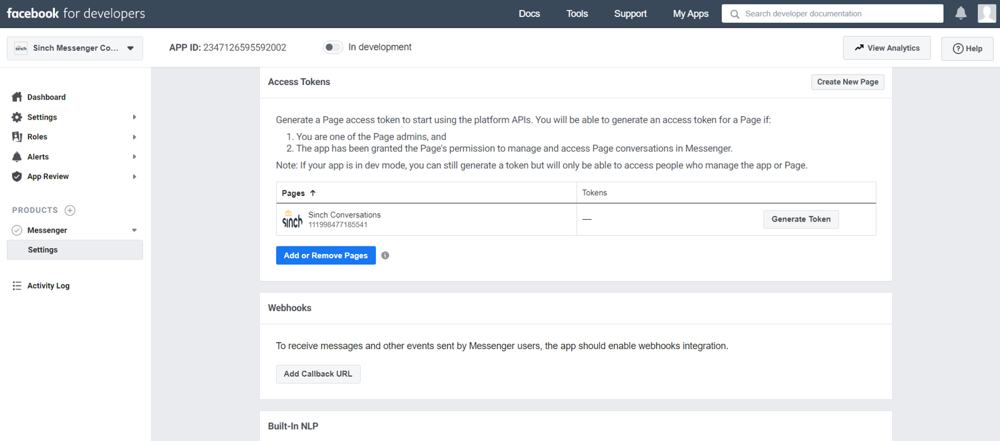
</p>

Then add the following **Callback URL** and **Verify Token**:

>
>Callback URL / 
>https://messenger-adapter.conversation-api.staging.sinch.com/adapter/v1/{{YOUR_SINCH_CONVERSATION_APP_ID}}/callback
>
>Verify Token / 
>5651d9fd-5c33-4d7a-aa37-5e3e151c2a92
>

<p align="center">
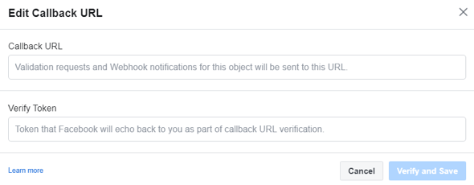
</p>

To complete your **Webhooks** configuration click on **"Add Subscriptions"**.

<p aling="center">

</p>

Choose **"messages"** and **"message_deliveries"** fields and click on **"Save"**.

<p align="center">
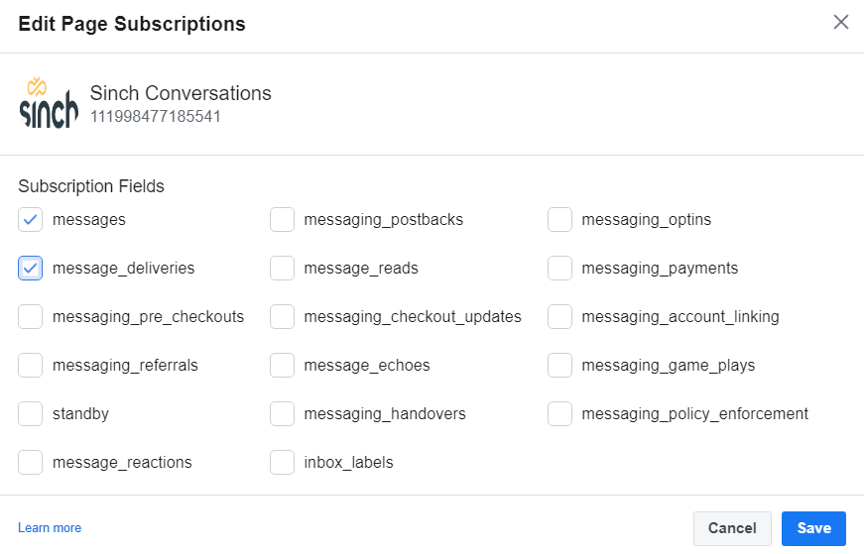
</p>

Great!  We are almost there.  Just a couple of more steps.


### Initiate an FB Messenger Chat and Respond with Sinch Conversations API

OK, we are ready for some action!  Visit your FB Page, click on **"Send Message"** and choose **"Test Button"**.

<p align="center">
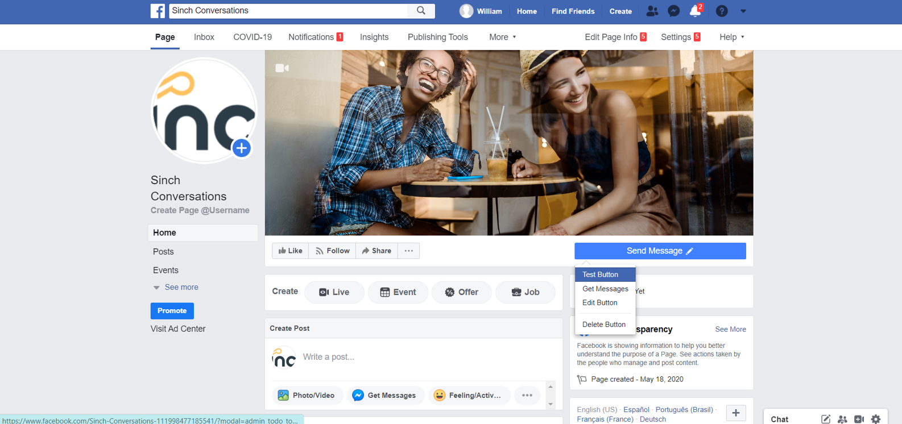
</p>

Enter a message into the **Messenger** chat window and **Send**.

<p align="center">
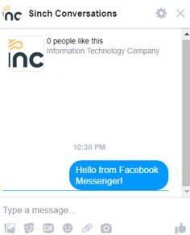
</p>

Use **Sinch Conversations API** to **List Contacts**, you should now see a new contact entry generated when a **Messenger Message** was posted from your FB Page.

```
{
    "contacts": [
        {
            "id": "J69H07BDS8G11RDF01E96CW660",
            "channel_identities": [
                {
                    "channel": "MESSENGER",
                    "channel_recipient_identity": "7746490198930851",
                    "app_id": "3FDS0PWWERGN1QX101E75WGS3Y"
                }
            ],
            "channel_priority": [
                "MESSENGER",
            ],
            "display_name": "",
            "email": "",
            "external_id": "",
            "metadata": ""
        }
    ],
    "next_page_token": ""
    
```

Use your newly created Sinch **Contact** to send a **Text Message** response using the **message:send** function.

```

{
    "app_id": "{{YOUR_SINCH_APP_ID}}",
    "recipient": {
    	"contact_id": "{{YOUR_SINCH_CONTACT_ID}}"
    },
    "message": {
        "text_message": {
            "text": "Hello, thank you for your inquiry, how can we help?"
        }
    },
    "channel_priority_order": [
        "MESSENGER"
    ]
}

```

**ALRIGHT!!  CONGRATULATIONS**, you have just sent your first Sinch Conversations Messenger Message!


